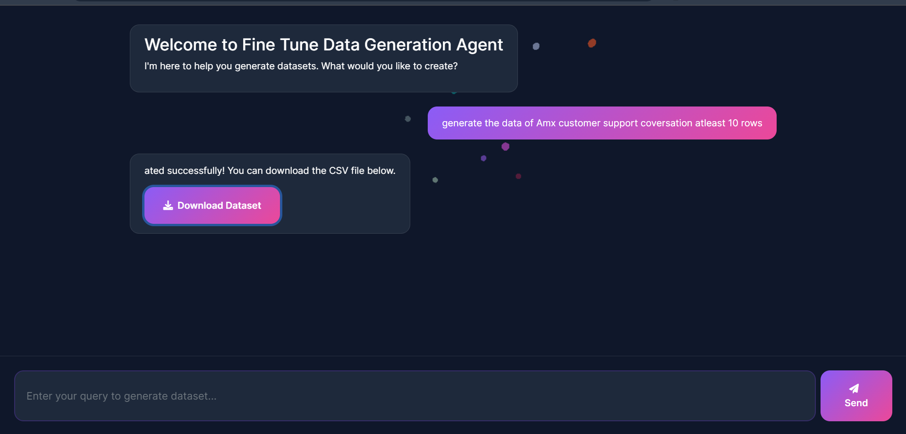

# Data Generation Agent

A LangChain-based agent that automatically generates diverse training data for fine-tuning LLM models. While optimized for customer support conversations, it can generate any type of instruction-response pairs, including but not limited to:
- Customer service interactions
- Technical support dialogues
- Product inquiries
- FAQ responses
- Educational content
- Code explanations
- Creative writing prompts




The agent creates structured data pairs (instructions and responses) in JSON format and saves them to CSV, making it easy to prepare training data for language models.

## Features

- Generates structured data in JSON format
- Supports custom data generation instructions
- Automatically saves data to CSV format
- Uses OpenAI's GPT models for data generation
- Implements a two-step process: instruction generation and response generation
- Versatile data generation for any domain or use case
- Customizable output format and structure

## Prerequisites

- Python 3.x
- OpenAI API key
- Required Python packages (install via pip):
  ```bash
  pip install langchain langchain-openai pandas numpy matplotlib python-dotenv
  ```

## Environment Setup

1. Create a `.env` file in the project root
2. Add your OpenAI API key:
  ```
  OPENAI_API_KEY=your_api_key_here
  ```

## Code Structure

### Main Components

1. **System Prompts**
   - `system_prompt`: Main agent prompt for overall data generation
   - `query_system_prompt`: Prompt for generating instructions
   - `response_system_prompt`: Prompt for generating responses

2. **Core Functions**
   - `generate_data(query)`: Generates instructions based on user query
   - `generate_response(instructions)`: Generates responses based on instructions
   - `save_to_csv(data)`: Saves generated data to CSV file

3. **Tools**
   - `generate_data_tool`: Tool for instruction generation
   - `generate_response_tool`: Tool for response generation
   - `csv_tool`: Tool for saving data to CSV

### Usage Example

```python
query = "provide me amx customer support data atleast 100 rows"
result = data_agent.invoke({"input": query})
```

## Output Format

The agent generates data in the following JSON format:
```json
{
    "instructions": ["instruction1", "instruction2", ...],
    "response": ["response1", "response2", ...]
}
```

## Data Generation Process

1. **Instruction Generation**
   - Takes user query as input
   - Generates natural language instructions
   - Returns JSON with "instructions" key

2. **Response Generation**
   - Takes instructions as input
   - Generates corresponding responses
   - Returns JSON with "response" key

3. **Data Storage**
   - Converts JSON data to DataFrame
   - Saves to CSV file named "data.csv"

## Configuration

- Model: GPT-4 (configurable via `model` parameter)
- Temperature: 0.8 (configurable)
- Default row count: 1000 (if not specified in query)

## Error Handling

The code includes basic error handling for:
- JSON parsing
- CSV file operations
- API calls

## Contributing

Feel free to submit issues and enhancement requests! 
